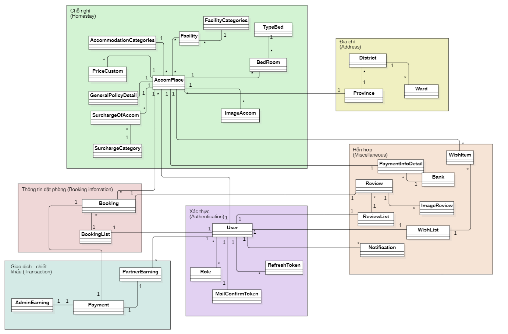

> Project này là một phần trong khóa luận tốt nghiệp của chúng tôi với đề tài: XÂY DỰNG WEBSITE OYO CHUYÊN CUNG CẤP DỊCH VỤ ĐẶT CHỖ
NGHỈ TRỰC TUYẾN.
> Repo này nguyên gốc là phần backend, sau đó tôi đã gộp thêm frontend. Có thể tham khảo nguyên bản frontend tại [đây](https://github.com/baohuyxxi/OYO)
#### Lược đồ class diagram tổng quan

## Sản phẩm
Một số trang của hệ thống.

| (1)                                                                                                                                                              | (2)                                                                                                                                                             | (3)                                                                                                                                                   |
| ---------------------------------------------------------------------------------------------------------------------------------------------------------------- | --------------------------------------------------------------------------------------------------------------------------------------------------------------- | ----------------------------------------------------------------------------------------------------------------------------------------------------- |
|                        |                     |           |
|                    |                    |             |
|                       |               |   |
|                    |              |        |
|                        |                     |  |
|                        |                     |  |
       
